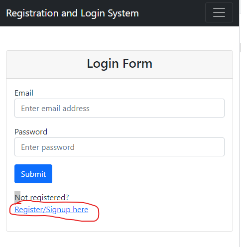

# Getting Started

### Requirements

- [Java 17 or Higher](https://www.oracle.com/uk/java/technologies/downloads/#jdk17-windows)
- [Maven](https://maven.apache.org/install.html)

### Running the Project

Once the above is installed then you can simply run `./mvnw spring-boot:run` from the root directory

Tests can be ran using the command `./mvnw test`

### Using the Project

When the project is launched the database is reset locally.
You can access it via `localhost:8080` in your web browser.

This will take you to the login page.

First from here you must register:
)

From here you can register, which redirects you to the login page.
Then you can login.

If you login successfully it takes you to the home page of the app.

#### Home Page

What you can do here:

- See a list of all books
- Search by Author
- Search by Year Range

### Add Page

What you can do here:

- Add a Book

### Update Page

- Find an existing Book
- Update an existing Book
- Delete an existing Book
- Borrow/Return an existing Book

## Additional Docs:

- [Project Summary](.docs/markdown/project-summary.md)
